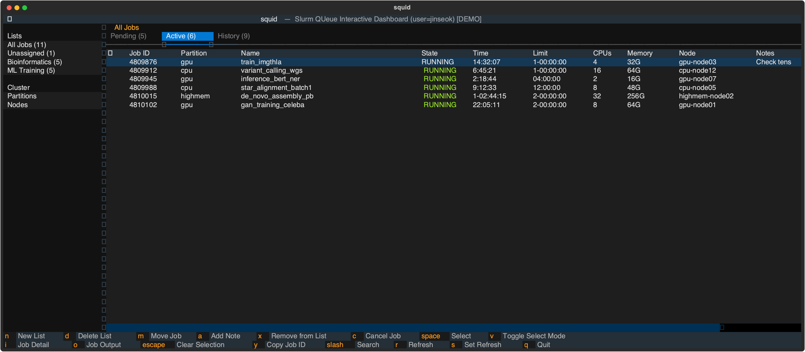

# Squid

[](https://github.com/pirl-unc/squid/actions/workflows/ci.yml)

Squid (**S**lurm **QU**eue **I**nteractive **D**ashboard) is a terminal UI (TUI) for monitoring, organizing, and managing SLURM jobs.
Built with [Textual](https://github.com/Textualize/textual).



## 01. Features

- **Tabbed job views** — Pending, Active, and History tabs with color-coded job states
- **Job history** — Completed, failed, cancelled, and timed-out jobs from the last 24 hours
- **Custom lists** — Organize jobs into lists (e.g. "ML Training", "Bioinformatics")
- **Job actions** — Cancel jobs, view detailed `scontrol`/`sacct` output, tail stdout/stderr
- **Multi-select** — Toggle select mode (`v`), select jobs with `space` or arrows, then act on all at once
- **Search** — Filter jobs by name or ID with `/`
- **Notes** — Annotate any job with a short note, persisted across sessions
- **Copy job ID** — Copy job IDs to the system clipboard (`y`)
- **Cluster overview** — Partition summary and per-node detail (`sinfo -N`) in a dedicated sidebar section
- **Auto-refresh** — Configurable refresh interval (default: 180s)
- **Persistent config** — Lists, assignments, and notes saved to `~/.squid.json`

## 02. Installation

Requires Python 3.10+.

```bash
pip install .
```

## 03. Usage

```bash
squid-tui                  # Show your jobs (uses $USER)
squid-tui --all            # Show jobs for all users
squid-tui --user alice     # Show jobs for a specific user
squid-tui --refresh 60     # Set auto-refresh to 60 seconds
squid-tui --version        # Print version
```

## 04. Demo

You can run squid with simulated SLURM data (no cluster required):

```bash
python examples/demo.py
```

## 05. Running Tests

```bash
pip install -e ".[dev]"
python -m pytest tests/ -v
```

## 06. License

Apache License 2.0

